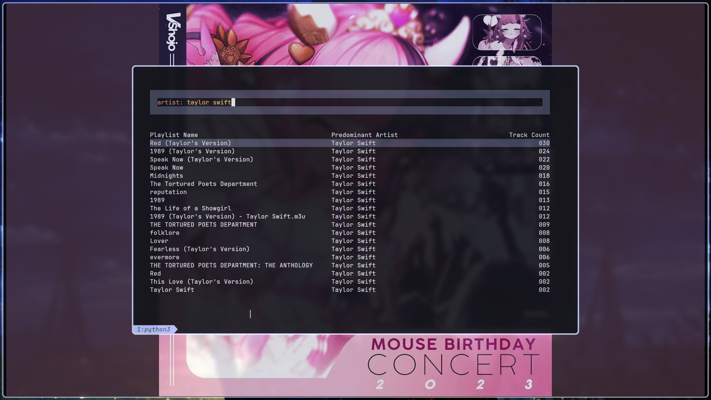

# Music Launcher
This is a music launcher built to be used on linux, with any 24 bit color supporting terminals. This project I built this project because i found standard music apps slow and cumbersome to use. Just a word of caution if you want to uses this app, it is not built to be easy to uses. I built this project intending for it to be just a personal project. If something breaks, you can try to post an issue, however it is very likely it will take forever or a long time for me to do anything about it. That said this project is pretty small and if you have a good grasp of python and c++, are willing to fix things if they break, and you are interested in a keyboard-centric local music launcher then this app is just the thing for you.
# Featers
This music launcher sets it's self apart from the norm, in a few ways. The first and most notable is probbly it's ux design. I spent a lot of time designing a custom querying language to be intuitive, fast, with maximum control. I built this language on the principle that you know what music you want to listen to, and you just want the fastest way to get that music into your ears. With query's ranging from simple declarations `taylor swift`, all the way to complex Boolean logic `songs: artist: taylor swift and title: anit-hero`, allowing fast but messy query's to more in depth and precises ones. Another notability is my launchers uses of mpv as the playback engine. With that, why would i build my own playback when mpv dose the job better then my app ever could. This app is for anyone that wants speed and control, and dose'nt need to be told what to listen to by some algorithm.
# Dependency's
This app has very few dependence's however dose have some. This app mpv to be installed, and my custom c++ [tuilib](https://github.com/neros29/tuilib) to be able to run. Other then that this project requires the packages rapidfuzz, wcwidth, and mutagen. 
# Compiling
To uses this project you must first be on linux with a terminal that accepts full color, you need to have terminfo, as well as utf8proc installed on your system, then you just run the make file. This will clone my tuilib repo and compile it. If you want to try this may work on mac, or with none full color terminals however i have not tested that so I choose to assume it doesn't.
- `make debug` compile the tuilib inside the repo
- `make install` install the app on your device
- `make uninstall` uninstall the app on your device
# Configs 
The app will auto genrate a config file in `~/.config/music-launcher/` look at this file to configure the app.
# Show case

